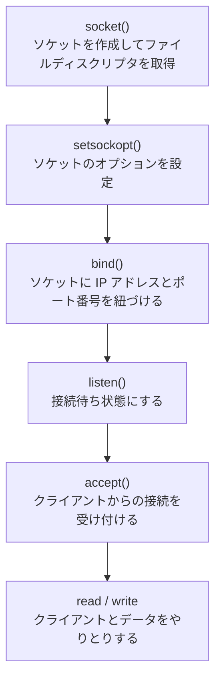

CodeCrafters は HTTP サーバーやシェルなどを車輪の再発明するウェブサイトです。C言語で Redis を実装した際に調べた関数や構造体を備忘録としてまとめました。

### ソケット通信の全体の流れ

サーバー側のソケット通信は以下の順で関数を呼び出します。



### 各関数のメモ

#### void setbuf(FILE *stream, char *buf)

ストリーム（`FILE *`）に対するバッファリング動作を制御する関数です。例えば `stdout` ストリームに対して設定すると、そこへ書き込む `printf` などが影響を受けます。

ストリームの代表的なものは以下の3つで、プログラム起動時に自動で用意されます。

| ストリーム | 説明 |
|-----------|------|
| `stdout` | 標準出力。`printf` はここに書き込む |
| `stderr` | 標準エラー出力。エラーメッセージの出力に使う |
| `stdin` | 標準入力。`scanf` や `fgets` はここから読み込む |

| 引数 | 説明 |
|------|------|
| `stream` | 対象のストリーム（`stdout`・`stderr` など） |
| `buf` | 使用するバッファへのポインタ。`NULL` を渡すとバッファリングが無効になる |

`NULL` を渡すと書き込みが即座に反映されます。デバッグ時や、ログをリアルタイムで確認したい場合に使います。

```c
setbuf(stdout, NULL);   // バッファなし（即時出力）
setbuf(stdout, buf);    // buf に指定したバッファを使う
```

#### int socket(int domain, int type, int protocol)

ソケットを作成してファイルディスクリプタを返します。失敗時は `-1` を返します。

ファイルディスクリプタとは、OS がファイルやソケットなどのリソースを識別するための整数値です。以降の `bind()` や `accept()` などにこの整数値を渡すことで、同じソケットを操作できます。

```c
int server_fd = socket(AF_INET, SOCK_STREAM, 0);
if (server_fd == -1) {
    printf("Socket creation failed: %s...\n", strerror(errno));
    return 1;
}
// AF_INET   : IPv4
// SOCK_STREAM: TCP（ストリーム型）
// 0         : プロトコルは自動選択
```

| 引数 | 代表的な値 | 意味 |
|------|-----------|------|
| `domain` | `AF_INET` | IPv4 |
| `type` | `SOCK_STREAM` | TCP |
| `protocol` | `0` | 自動 |

#### int setsockopt(int sockfd, int level, int optname, const void *optval, socklen_t optlen)

ソケットのオプションを設定します。Redis 実装でよく使うのは `SO_REUSEADDR` で、プロセス再起動直後でも同じポートにバインドできるようにします。

引数の意味は以下のとおりです。

| 引数 | 説明 |
|------|------|
| `sockfd` | 対象のソケットのファイルディスクリプタ |
| `level` | オプションが属するプロトコル層。ソケット全般のオプションは `SOL_SOCKET`、TCP 固有のオプションは `IPPROTO_TCP` を指定する |
| `optname` | 設定するオプション名。`level` に応じた定数を指定する |
| `optval` | オプションの値へのポインタ。有効/無効の切り替えは `int` 型の `1`/`0` を使うことが多い |
| `optlen` | `optval` のサイズ（バイト数） |

```c
int reuse = 1;
if (setsockopt(server_fd, SOL_SOCKET, SO_REUSEADDR, &reuse, sizeof(reuse)) < 0) {
    printf("SO_REUSEADDR failed: %s\n", strerror(errno));
    return 1;
}
// SOL_SOCKET  : ソケット全般のオプション
// SO_REUSEADDR: TIME_WAIT 状態のポートを再利用できるようにする
// &reuse      : 有効にする（1）
// sizeof(reuse): optval のサイズ
```

#### int bind(int sockfd, const struct sockaddr *addr, socklen_t addrlen)

ソケットに IP アドレスとポート番号を紐づけます。

| 引数 | 説明 |
|------|------|
| `sockfd` | 対象のソケットのファイルディスクリプタ |
| `addr` | バインドするアドレス情報（`sockaddr_in` を `sockaddr *` にキャストして渡す） |
| `addrlen` | `addr` のサイズ（バイト数） |

`sockaddr_in` は IPv4 のアドレス情報を保持する構造体です。各フィールドの意味は以下のとおりです。

| フィールド | 説明 |
|-----------|------|
| `sin_family` | アドレスファミリ。IPv4 なら `AF_INET` |
| `sin_port` | ポート番号。`htons()` でネットワークバイトオーダーに変換する必要がある |
| `sin_addr` | IP アドレス。`INADDR_ANY` はすべてのネットワークインターフェースで受け付ける |

```c
struct sockaddr_in serv_addr = {
    .sin_family = AF_INET,
    .sin_port   = htons(6379),          // ポート番号（ネットワークバイトオーダーに変換）
    .sin_addr   = { htonl(INADDR_ANY) }, // すべてのインターフェースで受け付ける
};

if (bind(server_fd, (struct sockaddr *)&serv_addr, sizeof(serv_addr)) != 0) {
    printf("Bind failed: %s\n", strerror(errno));
    return 1;
}
```

#### int listen(int sockfd, int backlog)

ソケットを接続待ち状態にします。

| 引数 | 説明 |
|------|------|
| `sockfd` | 対象のソケットのファイルディスクリプタ |
| `backlog` | 接続待ちキューの最大数。接続が集中した際にあふれた分は拒否される |

```c
if (listen(server_fd, 5) != 0) {
    printf("Listen failed: %s\n", strerror(errno));
    return 1;
}
```

#### int accept(int sockfd, struct sockaddr *addr, socklen_t *addrlen)

クライアントからの接続を受け付け、新しいファイルディスクリプタを返します。接続がくるまでブロックします。

| 引数 | 説明 |
|------|------|
| `sockfd` | `listen()` 済みのソケットのファイルディスクリプタ |
| `addr` | 接続してきたクライアントのアドレス情報が格納される |
| `addrlen` | `addr` のサイズ。呼び出し前にサイズをセットしておく必要がある |

```c
struct sockaddr_in client_addr;
int client_addr_len = sizeof(client_addr);

int client_fd = accept(server_fd, (struct sockaddr *)&client_addr, &client_addr_len);
if (client_fd == -1) {
    printf("Accept failed: %s\n", strerror(errno));
    close(server_fd);
    return 1;
}
```

#### ssize_t read(int fd, void *buf, size_t count)

ファイルディスクリプタからデータを読み込みます。戻り値は実際に読み込んだバイト数で、接続が閉じられた場合は `0`、失敗時は `-1` を返します。

| 引数 | 説明 |
|------|------|
| `fd` | 読み込み元のファイルディスクリプタ |
| `buf` | 読み込んだデータを格納するバッファへのポインタ |
| `count` | 読み込む最大バイト数 |

```c
char buf[1024];
ssize_t bytes_read = read(client_fd, buf, sizeof(buf));
if (bytes_read == -1) {
    printf("Read failed: %s\n", strerror(errno));
} else if (bytes_read == 0) {
    printf("Client disconnected\n"); // 接続が閉じられた
}
```

#### ssize_t send(int sockfd, const void *buf, size_t len, int flags)

接続中のソケットにデータを送信します。戻り値は実際に送信できたバイト数で、失敗時は `-1` を返します。

| 引数 | 説明 |
|------|------|
| `sockfd` | `accept()` で取得したクライアントのファイルディスクリプタ |
| `buf` | 送信するデータへのポインタ |
| `len` | 送信するデータのバイト数 |
| `flags` | 送信オプション。通常は `0` を指定する |

```c
const char *response = "+PONG\r\n"; // Redis プロトコル（RESP）における単純文字列レスポンス
if (send(client_fd, response, strlen(response), 0) == -1) {
    printf("Send failed: %s\n", strerror(errno));
}

close(client_fd);
close(server_fd);
```

#### void *malloc(size_t size)

ヒープ領域にメモリを動的確保し、そのポインタを返します。失敗時は `NULL` を返します。確保したメモリは `free()` で明示的に解放する必要があります。

`accept()` で取得した `client_fd` をスレッドに渡すために使います。

```c
int *client_fd = malloc(sizeof(int));
if (!client_fd) {
    printf("malloc failed\n");
    continue;
}
*client_fd = accept(server_fd, ...);
```

スタック変数（`int client_fd`）をそのままスレッドに渡してしまうと、次のループで値が上書きされてしまいます。ヒープに確保することで、スレッドが参照し終わるまで値が保持されます。スレッド側（`handle_client`）の先頭で `free()` して解放します。

```c
void *handle_client(void *arg) {
    int client_fd = *(int *)arg;
    free(arg); // ここで解放
    ...
}
```

#### pthread

`<pthread.h>` で提供される POSIX スレッドのAPIです。Redis の実装では複数のクライアントを同時に処理するために使います。

**pthread_create**

```c
int pthread_create(pthread_t *thread, const pthread_attr_t *attr,
                   void *(*start_routine)(void *), void *arg);
```

新しいスレッドを作成します。

| 引数 | 説明 |
|------|------|
| `thread` | 作成されたスレッドのIDが格納される |
| `attr` | スレッドの属性。通常は `NULL`（デフォルト設定） |
| `start_routine` | スレッドが実行する関数へのポインタ |
| `arg` | `start_routine` に渡す引数 |

```c
pthread_t thread;
if (pthread_create(&thread, NULL, handle_client, client_fd) != 0) {
    printf("Thread creation failed: %s\n", strerror(errno));
    close(*client_fd);
    free(client_fd);
    continue;
}
```

**pthread_detach**

```c
int pthread_detach(pthread_t thread);
```

スレッドを切り離し、終了時にリソースが自動で解放されるようにします。`pthread_join()` を呼び出す必要がなくなります。クライアント処理のように「終わったら捨てる」スレッドに適しています。

```c
pthread_detach(thread);
// 以降は thread の終了を待たずにループを続ける
```

### まとめ

CodeCrafters だと、教科書で読むだけでは掴みにくいソケットの使い方が実際に手を動かして理解できるのでおすすめです。
