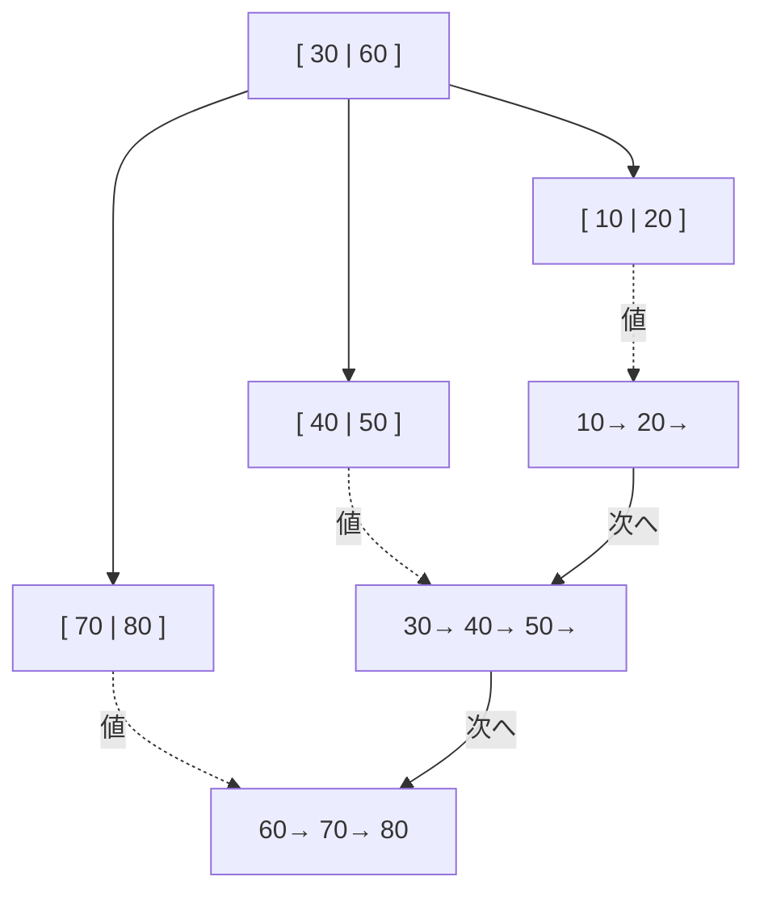
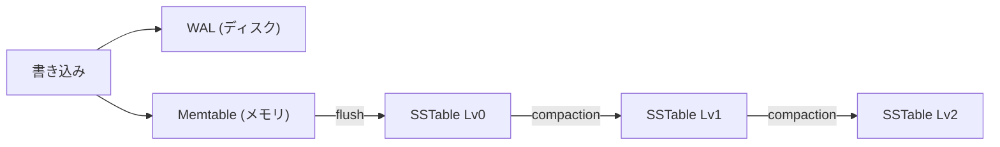
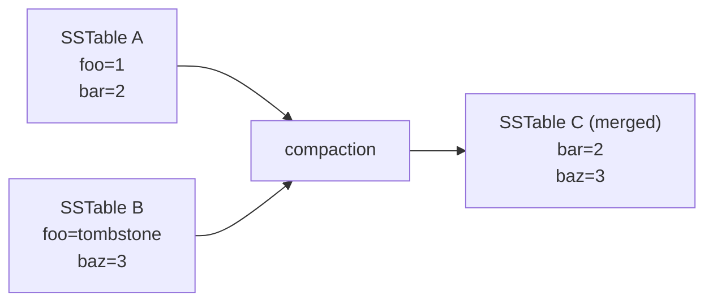

最近 Build Your Own Database From Scratch in Go という本を読んでいるのですが、B-tree や LSM-tree まわりの説明がいまいち理解できなかったので、他の文献も参考にしつつ自分なりにまとめてみました。

代表的なインデックスである以下の2つについて調べてみました。

- B-tree / B+tree
- LSM-tree

### B-tree

B-tree は各ノードが複数のキーと子へのポインタを持つ balanced tree です。ノードあたりのキーを増やせるので木の高さが低くなり、ディスクからの読み込み回数を抑えられます。

内部ノードの中身は「ポインタ → キー → ポインタ → キー → ポインタ」のように、キーの間にポインタが挟まる形になっています。キーが `n` 個あればポインタは `n+1` 個です。リーフノードは子を持たないのでキーだけが並びます。


`*` がポインタで、それぞれのポインタはキーで区切られた範囲の子ノードを指します。例えば、ルートの一番左のポインタは「30 未満のキーを持つノード」を、真ん中のポインタは「30 以上 60 未満」を、一番右は「60 以上」を指します。

`50` を探すときは、ルートで `30 <= 50 < 60` なので真ん中のポインタを辿り、リーフノード `[40 | 50]` に到達して見つかります。比較は2回だけで済みます。

特徴は以下のとおりです。

- 各ノードに複数のキーが入る（ノードのサイズはディスクのページサイズに合わせるのが一般的）
- 木の高さが低く、`O(log n)` で探索できる
- 内部ノードにも値（または値へのポインタ）を持つ

### B+tree

B+tree は B-tree の派生で、現代のリレーショナルデータベースで広く使われている構造です。B-tree との違いは以下の2点です。

- 値はリーフノードにのみ格納される（内部ノードはキーだけ）
- リーフノード同士が連結リストでつながっている



リーフが連結リストになっていることで、`WHERE id BETWEEN 20 AND 70` のような範囲スキャンが効率的に行えます。一度該当のリーフに到達したら、あとはリーフをたどるだけで済みます。

内部ノードに値を持たない分、1ノードあたりに収まるキーが増え、結果として木の高さが下がりやすいのもメリットです。

### LSM-tree

LSM-tree (Log-Structured Merge-tree) は書き込み性能を重視した構造で、Cassandra や RocksDB などで採用されています。

基本的なアイデアは「**書き込みはメモリに溜めてシーケンシャルに吐き出す**」というものです。ディスクへのランダム書き込みを避けるためにこのような設計になっています。

全体像は以下のとおりです。



#### Memtable

Memtable はメモリ上にあるソート済みのデータ構造（赤黒木やスキップリストで実装されることが多い）です。書き込みはまずここに入ります。

メモリなのでプロセスが落ちると消えてしまうため、書き込みと同時に WAL (Write-Ahead Log) にも追記しておき、復旧時に Memtable を再構築できるようにします。

#### SSTable

Memtable がある程度のサイズに達すると、ディスクに書き出されます。このディスク上のファイルを **SSTable (Sorted String Table)** と呼びます。

SSTable には以下の特徴があります。

- キーでソート済み
- 一度書いたら **イミュータブル**（後から書き換えない）
- 末尾にキーの位置を示すインデックスを持つことが多い

イミュータブルなのでロックなしで読めるのが LSM-tree の強みです。

```text
SSTable のイメージ
+--------------------+
| key=apple  val=1   |
| key=banana val=2   |
| key=cherry val=3   |
| key=durian val=4   |
+--------------------+
| index: apple→0行   |
|        cherry→2行  |
+--------------------+
```

#### Tombstone

LSM-tree では SSTable をその場で書き換えることができないので、削除するときも「削除した」というマーカーを書き込みます。これを **Tombstone（墓石）** と呼びます。

```text
時系列での書き込み:
  PUT key=foo val=1   → SSTable Lv0 に記録
  DELETE key=foo      → tombstone を記録
```

読み込み時には新しい SSTable から順に見ていき、tombstone を見つけたら「このキーは削除済み」と判断します。実際に古いデータが消えるのは後述の compaction のタイミングです。

#### Compaction

書き込みが続くと SSTable がどんどん増えていきます。読み込みのたびに大量の SSTable をスキャンするのは非効率なので、定期的に複数の SSTable をマージして1つにまとめる処理を行います。これを **compaction** と呼びます。



compaction では以下のことが行われます。

- 同じキーがあれば新しい方を残す
- tombstone があればそのキーを削除する
- 複数の SSTable を1つにまとめてサイズを抑える

compaction の戦略は LevelDB や RocksDB で採用されている **Leveled Compaction** や、Cassandra で使われる **Size-Tiered Compaction** など複数あります。

#### Bloom filter

LSM-tree で「キー `foo` を取得したい」と言われたとき、最悪すべての SSTable を見にいく必要があります。これを避けるために **Bloom filter** がよく併用されます。

Bloom filter は「**そのキーは絶対にここには無い**」を高速に判定するための確率的データ構造です。ハッシュ関数を複数使って、キーをビット列にマップします。

```text
Bloom filter (ビット配列):
  key=foo を h1, h2, h3 でハッシュ → bit[2], bit[5], bit[9] を 1 に
  key=bar を h1, h2, h3 でハッシュ → bit[1], bit[5], bit[7] を 1 に

  [0,1,1,0,0,1,0,1,0,1,...]

検索 key=baz:
  h1, h2, h3 → bit[3], bit[6], bit[8] を確認
  どれかが 0 → 「絶対に無い」と判定でき、SSTable を見にいかなくて済む
```

特徴は以下のとおりです。

- false negative はない（「ある」と言われたら本当にあるかは要確認、「無い」と言われたら本当に無い）
- false positive はあり得る
- ビット配列とハッシュ関数だけなのでメモリ効率がよい

各 SSTable に対応する Bloom filter を持っておくことで、無駄なディスク読み込みを大幅に減らせます。

### B+tree と LSM-tree の比較

ざっくりまとめると以下のような特性の違いがあります。

| 観点 | B+tree | LSM-tree |
|------|--------|----------|
| 書き込み | ランダム書き込みになりやすい | シーケンシャル書き込み中心で高速 |
| 読み込み | 1回の探索で済むので速い | 複数 SSTable を見る可能性があり遅め（Bloom filter で緩和）|
| 範囲スキャン | リーフの連結リストで高速 | 各 SSTable をマージしながら読む |
| 削除 | その場で更新 | tombstone を書いて compaction で消す |
| 代表例 | PostgreSQL, MySQL | Cassandra, RocksDB |

書き込みヘビーなワークロードでは LSM-tree、読み込みや範囲スキャンが多いワークロードでは B+tree が向いています。ただ最近は両者のいいとこ取りを狙った実装（PostgreSQL の `pg_lsm` のような拡張）もあるので、適材適所で選ぶのがよさそうです。

### 参考

- [Designing Data-Intensive Applications](https://www.oreilly.com/library/view/designing-data-intensive-applications/9781491903063/)
- [LSM-based Storage Techniques: A Survey](https://arxiv.org/abs/1812.07527)
- [RocksDB Wiki](https://github.com/facebook/rocksdb/wiki)
