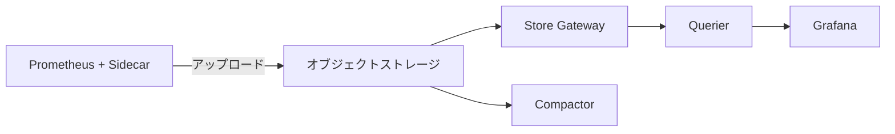
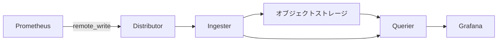

Prometheusはデフォルトでローカルディスクにメトリクスを保存しますが、長期保存やHA構成を実現するためにリモートストレージが必要になります。代表的な選択肢としてThanos・Cortex・Mimirの3つがあり、業務で検討する機会があったので比較してまとめました。

### 比較表

| | [Thanos](https://github.com/thanos-io/thanos) | [Cortex](https://github.com/cortexproject/cortex) | [Mimir](https://github.com/grafana/mimir) |
|---|---|---|---|
| 開発元 | コミュニティ (元Improbable) | コミュニティ (元Weaveworks) | Grafana Labs |
| GitHub Stars | ~14,200 | ~5,900 | ~5,200 |
| ライセンス | Apache 2.0 | Apache 2.0 | AGPL-3.0 |
| CNCF | Incubating | Incubating | - |
| データ取り込み | Sidecar (pull) / Receiver (push) | remote_write (push) | remote_write (push) |
| マルチテナント | 限定的 (Receiver経由) | ネイティブ対応 | ネイティブ対応 |
| ダウンサンプリング | あり (ネイティブ) | なし | なし |
| オブジェクトストレージ | S3, GCS, Azure, Swift, COS | S3, GCS, Azure, Swift | S3, GCS, Azure, Swift |

### 各プロジェクトの特徴

#### Thanos

コミュニティ主導でCNCF Incubatingプロジェクトになっています。最大の特徴はSidecarパターンで、既存のPrometheusに手を加えずに横に並べる形でデプロイできます。

各コンポーネントの役割:

- Sidecar: PrometheusのPodに並べてデプロイするコンテナ。PrometheusがローカルにTSDBブロックをフラッシュするタイミング（2時間ごと）でオブジェクトストレージにアップロードします
- Store Gateway: オブジェクトストレージ上の過去データを読み出し、クエリに応答するコンポーネント
- Querier: PromQL互換のクエリエンドポイント。SidecarやStore Gatewayに問い合わせて結果を集約し、Grafanaに返します
- Compactor: オブジェクトストレージ上のブロックをダウンサンプリング・コンパクションするバックグラウンドプロセス

ダウンサンプリング（5分・1時間粒度）をCompactorがネイティブでサポートしているため、数年分の長期データを扱う場合でも高速にクエリできます。マルチテナントはReceiverコンポーネント経由で実現できますが、CortexやMimirと比較すると後付けの印象が強いです。

既存のPrometheusをそのまま活かせる点が最大の強みで、段階的に導入できます。スター数も3つの中で最も多く、コミュニティの安定感があります。

#### Cortex

Weaveworksが開発を始め、現在はCNCF Incubatingプロジェクトとして継続しています。マルチテナントとスケーラビリティを最初から設計に組み込んだマイクロサービスアーキテクチャが特徴で、Prometheusからの `remote_write` でデータを受け取ります。

各コンポーネントの役割:

- Distributor: `remote_write` リクエストを受け取り、複数のIngesterに振り分けるコンポーネント。どのテナントのデータかは `X-Scope-OrgID` リクエストヘッダーで識別します
- Ingester: 受け取ったメトリクスを一時的にメモリに保持し、定期的にオブジェクトストレージへ書き出すコンポーネント
- Querier: PromQLクエリを処理するコンポーネント。IngesterとオブジェクトストレージからデータをフェッチしてGrafanaに返します

GrafanaクラウドはもともとCortexで動いていました。

ただし、2022年3月にGrafana LabsがMimirを公開して以降、CortexへのGrafana Labsの貢献はほぼ停止しています。新規プロジェクトでマイクロサービス型を選ぶ場合は、後継にあたるMimirを選ぶほうが無難です。CortexからMimirへの移行ガイドも公式で提供されており、多くの構成で10分以内に移行できると案内されています。

#### Grafana Mimir

Grafana Labsが2022年にCortexをフォークして公開したプロジェクトです。Cortexから不要な機能を削ぎ落とし、設定パラメータを大幅に整理した上でいくつかの大きな改善を加えています。3つの中で最も活発に開発されており、Grafana Cloud MetricsやGrafana Enterprise Metrics (GEM)の基盤として実際に使われています。

スター数はThanos・Cortexより少ないですが、新しいプロジェクトであることを考えると妥当な数字です。1テナントあたり10億アクティブ系列での動作実績があり、スケーラビリティは3つの中で最も高いとされています。

ライセンスがAGPL-3.0である点は注意が必要です。内部利用であれば問題になりにくいですが、Mimirを組み込んだサービスを外部に提供する場合はソースコードの開示義務が生じます。

### まとめ

既存のPrometheusに手を加えずに長期保存だけ追加したい場合はThanosが最も低リスクです。マルチテナントや大規模スケールが必要な場合は、CortexよりMimirを選ぶのが現時点では賢明だと思います。ただしMimirのAGPLライセンスが組織のポリシーに合わない場合は、Apache 2.0のThanosかCortexが選択肢になります。

### 参考

- [Thanos 公式サイト](https://thanos.io/)
- [Cortex 公式サイト](https://cortexmetrics.io/)
- [Grafana Mimir 公式ドキュメント](https://grafana.com/docs/mimir/latest/)
